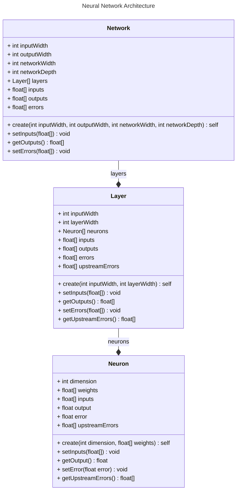

# neural-network-homebrewed

```mermaid
---
title: Neural Network Architecture
---
classDiagram

  class Network {
     + int inputWidth
     + int outputWidth
     + int networkWidth
     + int networkDepth
     + Layer[] layers
     + create(int inputWidth, int outputWidth, int networkWidth, int networkDepth) self

     + float[] inputs
     + float[] outputs
     + setInputs(float[]) void
     + getOutputs() float[]

     + float[] errors 
     + setErrors(float[]) void
  }

  class Layer {
     + int inputWidth
     + int layerWidth     
     + Neuron[] neurons
     + create(int inputWidth, int layerWidth) self
     
     + float[] inputs
     + float[] outputs
     + setInputs(float[]) void
     + getOutputs() float[]
     
     + float[] errors
     + float[] upstreamErrors 
     + setErrors(float[]) void
     + getUpstreamErrors() float[]
  }

  class Neuron {
     + int dimension
     + float[] weights
     + create(int dimension, float[] weights) self

     + float[] inputs
     + float output
     + setInputs(float[]) void
     + getOutput() float  
     
     + float error
     + float[] upstreamErrors
     + setError(float error) void
     + getUpstreamErrors() float[]
  }

  Network --* Layer : layers
  Layer --* Neuron : neurons
```