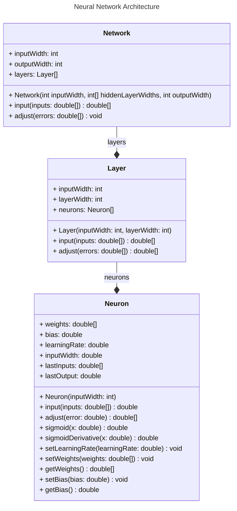

# neural-network-homebrewed

```mermaid
---
title: Neural Network Architecture
---
classDiagram

  class Network {
     + inputWidth: int 
     + outputWidth: int 
     + layers: Layer[]

     + Network(int inputWidth, int[] hiddenLayerWidths, int outputWidth)
     + input(inputs: double[]) double[]
     + adjust(errors: double[]) void
  }

  class Layer {
     + inputWidth: int 
     + layerWidth: int     
     + neurons: Neuron[]
     
     + Layer(inputWidth: int, layerWidth: int)
     + input(inputs: double[]) double[]
     + adjust(errors: double[]) double[]
  }

  class Neuron {
     + weights: double[]
     + bias: double
     + learningRate: double
     + inputWidth: double
     + lastInputs: double[]
     + lastOutput: double

     + Neuron(inputWidth: int)
     + input(inputs: double[]) double
     + adjust(error: double) double[]
     + sigmoid(x: double) double
     + sigmoidDerivative(x: double) double
     + setLearningRate(learningRate: double) void
     + setWeights(weights: double[]) void
     + getWeights() double[]
     + setBias(bias: double) void
     + getBias() double
  }

  Network --* Layer : layers
  Layer --* Neuron : neurons
```
